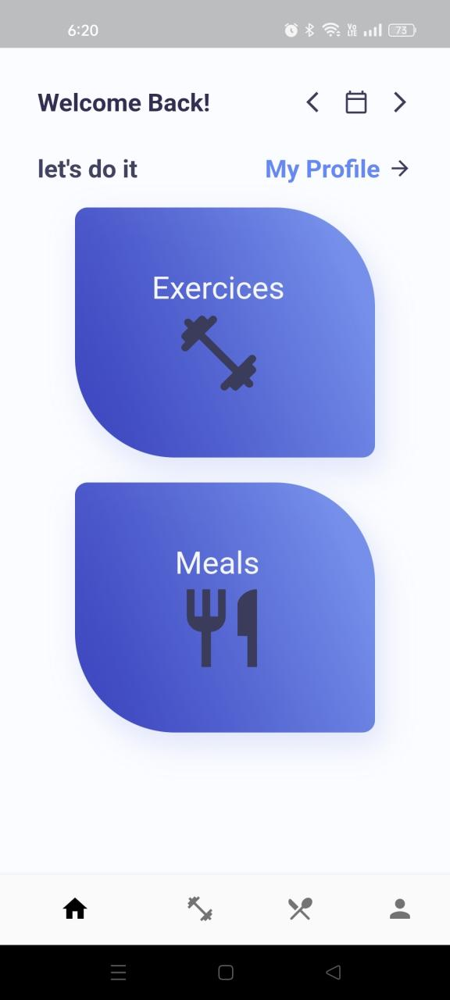
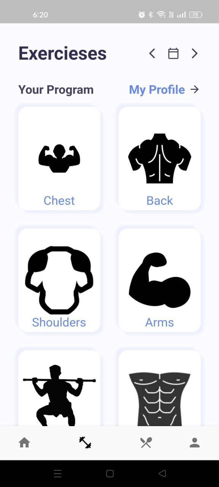
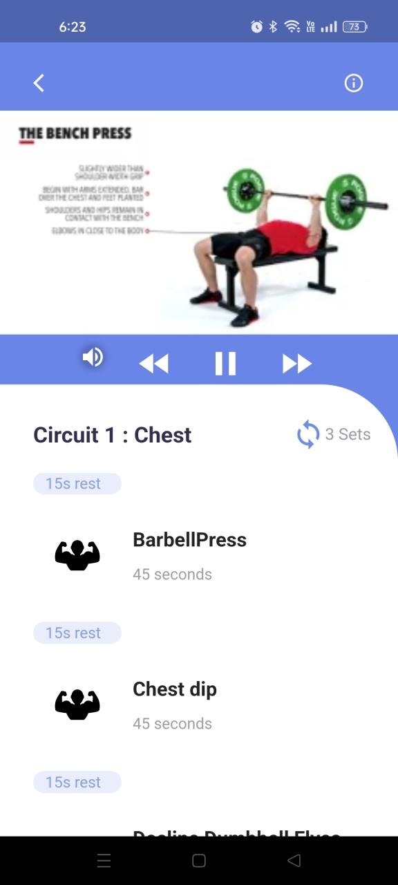

# Fit Journey

Fit Journey is a Flutter fitness mobile app that helps users follow workout programs, browse exercises, view meal ideas, and manage their profile from a clean mobile interface.

## Screenshots

| Splash | Login | Home |
|---|---|---|
|  |  |  |

| Exercises | Workout Details | Meals |
|---|---|---|
|  |  |  |

## Features

- Email and password login screen
- Google sign-in UI
- Home dashboard
- Exercise categories
- Workout circuit/details page
- Meals listing page
- Profile navigation
- Bottom navigation bar

## Tech Stack

- Flutter
- Dart
- Firebase integration
- Android

## Getting Started

Install dependencies:

```bash
flutter pub get
```

Run the app:

```bash
flutter run
```

Build APK:

```bash
flutter build apk --release
```

## Project Structure

```text
lib/          Main Flutter source code
assets/       App images and assets
android/      Android project files
ios/          iOS project files
web/          Web project files
```

## Notes

This repository contains the Flutter project source and screenshots for documentation.
